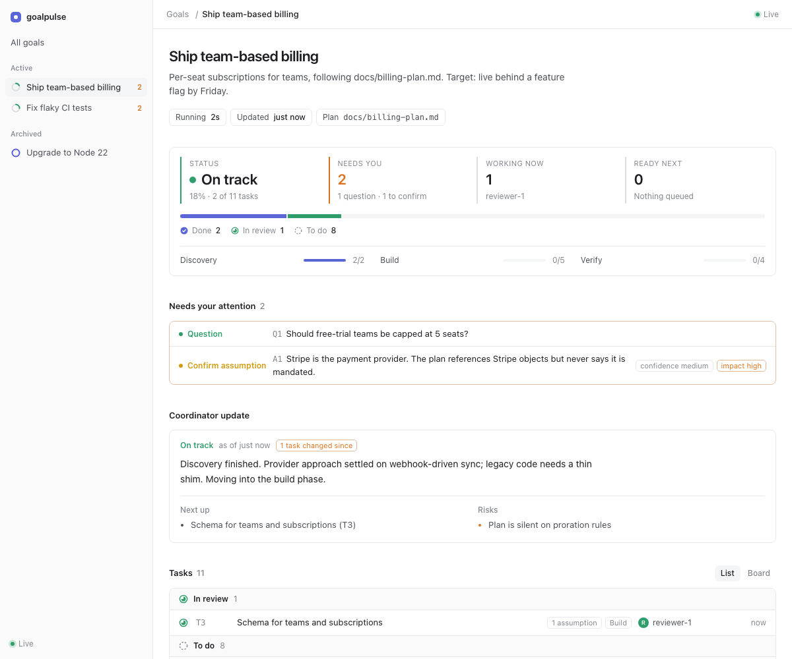

# goalpulse

Visual progress reporting for agent-driven goals. Your coordinating agent reports tasks, assumptions, questions and status; you watch a live dashboard instead of a stream of text or a bloated `progress.md`.

## Install

In Claude Code:

```
/plugin marketplace add raysca/goalpulse
/plugin install goalpulse@raysca-tools
```

## Use

Tell your agent:

> Use goalpulse to report progress on this.

That is all. The agent creates a goal, logs tasks and assumptions as it works, and replies with a dashboard link (`http://127.0.0.1:4317`) that updates live. To pick work back up in a new session: *"Resume the goalpulse goal."*

Requires Node.js 18+. No other dependencies, nothing to configure. Logs live in `.goalpulse/` in your project and are git-ignored by default (delete `.goalpulse/.gitignore` to commit them).

## What you get



- **Overview of every goal** in the project, goals needing you first.
- **Per goal:** the coordinator's report, progress, what needs your attention (open questions, low-confidence assumptions, blocked work), a task board, assumptions and best guesses, and an activity feed.
- **Resume:** a fresh agent gets a briefing (plan, last report, what is done, stale in-flight work, your new answers) and carries on.
- **Snapshots:** `goalpulse render` writes a single shareable HTML file.

Sub-agents report to the coordinator as usual; only the coordinator writes to the log, which keeps one voice.

## Codex, Antigravity and other agents

The skill is a single `SKILL.md` ([Agent Skills format](https://agentskills.io)), and the only other thing an agent needs is the `goalpulse` command.

```bash
npm install -g github:raysca/goalpulse      # puts `goalpulse` on PATH (Node 18+)
cd your-project
goalpulse install-skill                     # -> .agents/skills/goalpulse (Codex, Antigravity)
goalpulse install-skill --global            # -> ~/.agents/skills (Codex, every project)
goalpulse install-skill --agent claude      # -> .claude/skills, if you skip the plugin
```

Then tell the agent: *"Use goalpulse to report progress on this."* If `goalpulse` is not on PATH the skill falls back to `npx -y github:raysca/goalpulse`.

For agents without skills support (Cursor, Copilot, Aider, ...), paste `skills/goalpulse/SKILL.md` into `AGENTS.md` or the goal prompt. The contract is just the CLI.

```bash
goalpulse dashboard --open                    # background dashboard
npm run demo                                  # simulated run, three goals
```

## Multiple goals in one project

Each goal has its own log, `.goalpulse/goals/<slug>/events.jsonl`, **and its own tiny command**. `goalpulse goal "Title"` creates both and prints how to call it (`--id` chooses the slug):

```bash
goalpulse goal "Fix flaky CI tests"
#   .goalpulse/goals/fix-flaky-ci-tests/gp   <- this goal's own command

.goalpulse/goals/fix-flaky-ci-tests/gp add "Reproduce locally"   # the goal is built in: no --goal
.goalpulse/goals/fix-flaky-ci-tests/gp start T1 --by debugger-1
goalpulse goals                                                  # list all goals: health, progress, items needing you
```

The per-goal command (`gp`, plus `gp.cmd` on Windows) is a few lines that set the goal and the `.goalpulse` location, then call goalpulse. Hand it to a coordinator and it **cannot log to the wrong goal**, which matters because agent shells do not keep environment variables between calls. It finds `.goalpulse` relative to itself, so it works from any directory and survives moving the project, and `goalpulse resume` re-creates it if it is missing.

- **Isolation:** commands act on exactly one goal. With the shared `goalpulse` command, `--goal <slug>` (or `GOALPULSE_GOAL`) may be omitted only when a single goal is open (not archived, not complete). With several open, goalpulse **refuses to guess** and lists them.
- **Dashboard:** with more than one goal, the home page is an overview. Goals with items waiting on you sort first. Click (or press Enter on) a goal to open it, and use "← All goals" to return. Navigation is held in the page itself, so it works inside sandboxed previews as well as a normal browser tab; where URL hashes work, `#/slug` is also a shareable deep link. Archived goals sit behind a toggle.
- **Archiving:** `goalpulse archive` / `unarchive` hide or restore a goal. It only adds an event, so nothing is deleted.
- **Parallel safety:** goals are separate files, and short single-line appends do not interleave. The test suite runs 50 parallel writers across two goals and checks nothing is lost or crossed.

## Resuming a goal

An agent that takes over a goal (a new session, a crashed run, a compacted context, a different coordinator) runs:

```bash
goalpulse resume --goal ship-team-billing --by coordinator-2
```

That **logs the handover** (it shows on the dashboard as "Work resumed by coordinator-2" and "resumed 1×") and **prints a briefing**:

- the goal, description and **plan path** (`goalpulse goal --plan docs/plan.md`) to re-read
- the last coordinator report: summary, next steps, risks
- **done** tasks with their results, so finished work is not redone
- **in flight** tasks, flagged `STALE` if quiet for 30+ minutes. Their agents probably no longer exist, so the resumer verifies them before trusting them
- blocked/failed, ready, and waiting-on-dependencies tasks
- **human input** (answers and assumption rulings), with items newer than the last report marked `NEW` because they may not have been acted on yet
- open questions, open assumptions, and recent decisions, findings and risks
- numbered steps for what to do next

`--no-log` prints the briefing without logging another handover. Re-running `goalpulse goal "Same title"` after a crash does **not** fork the work: it refuses and points at `resume`. The dashboard shows a "quiet" chip on any in-progress task with no update for 30 minutes, so a dead agent is visible to you too.

Because state is rebuilt by replaying the log, resuming needs no saved session; the log is the memory.

## What the dashboard shows (per goal)

| Area | Source |
|---|---|
| **Coordinator report**: latest summary, next up, risks, health | `goalpulse report` |
| **Progress**: segmented bar, per-phase progress | task statuses |
| **Needs your attention**: open questions, blocked/failed tasks, low-confidence or high-impact assumptions | `ask`, `block`, `fail`, `assume` |
| **Task board / list**: to do (ready vs waiting on deps), in progress, in review, blocked, done, with owner, result and "quiet" warnings | `add`, `plan`, `start`, `review`, `done`... |
| **Assumptions & best guesses**: why, alternative considered, confidence, impact if wrong; filter by needs-review/open/resolved | `assume`, `resolve` |
| **Activity**: chronological feed including decisions, findings, risks and handovers | all events |

Light and dark themes follow the system setting. Changed cards flash briefly when live.

## Sharing

- `goalpulse render -o report.html` writes a **self-contained snapshot** of every goal (state embedded, no server); add `--goal slug` for one goal. Attach it to a PR, drop it in Slack, or commit it.
- `goalpulse serve --host 0.0.0.0` exposes the live view on your network. It is read-only and has no authentication, so use it only on trusted networks.
- Logs are plain text and diff-friendly. Commit `.goalpulse/` for history, or git-ignore it (the default `.gitignore` does).

## CLI reference

```
goalpulse goal "Title" [--desc "..."] [--plan docs/plan.md] [--id slug]
goalpulse goals [--json]
goalpulse resume [--no-log] [--by agent]
goalpulse archive | unarchive

goalpulse plan [--file plan.json]            JSON array of {id,title,phase,deps,owner,desc} on stdin or file
goalpulse add "Title" [--id T4] [--deps T1,T2] [--phase "Build"] [--owner agent]

goalpulse start|review|done|block|unblock|fail|drop|reopen <id> ["text"] [--by agent]

goalpulse assume "text" [--why] [--alt] [--confidence low|medium|high] [--impact low|medium|high] [--task T3]
goalpulse resolve <A-id> confirmed|rejected|revised ["note"]
goalpulse ask "question" [--option "a" --option "b"] [--task T3]
goalpulse answer <Q-id> "answer"
goalpulse note "text" [--kind decision|finding|risk|note] [--task T3]

goalpulse report "summary" [--health on-track|at-risk|blocked] [--next "..."]... [--risk "..."]...
goalpulse status [--json]       one goal's summary (the goal list if several are open)
goalpulse dashboard [--open] [--stop]     # background dashboard; prints its URL
goalpulse serve [--port 4317] [--host 127.0.0.1] [--open]
goalpulse render [--goal slug] [-o file.html] [--open]
```

Everything that acts on a goal takes `--goal <slug>`. Environment: `GOALPULSE_DIR` (the `.goalpulse` folder; default is the nearest one walking up from the current directory), `GOALPULSE_GOAL` (default `--goal`), `GOALPULSE_AGENT` (default `--by`).

## Event model

One JSON object per line:

```json
{"ts":"2026-10-05T07:41:02.114Z","type":"status","id":"T3","status":"done","text":"Schema merged","by":"backend-1"}
{"ts":"...","type":"assume","id":"A4","text":"Prorate to the day","why":"Plan is silent","alt":"Next cycle","confidence":"low","impact":"high","task":"T5"}
```

Types: `goal`, `task`, `status`, `assume`, `resolve`, `note`, `ask`, `answer`, `report`, `resume`, `archive`, `unarchive`. State is derived by replaying a goal's log (`lib/reduce.js`), so the log is the single source of truth and the dashboard is a pure view of it. Unknown task ids are created implicitly and unparsable lines are skipped, so a sloppy agent never breaks the view. A pre-existing single `.goalpulse/events.jsonl` is exposed as the goal `default`.

## Design notes

- **Append-only events, not a mutable file.** No merge conflicts, trivially auditable, and a bad write cannot corrupt earlier state.
- **Coordinator is the only writer.** Matches the project-manager model and avoids interleaved writes.
- **Explicit goal, never a "current goal" pointer.** A shared pointer is global mutable state that parallel coordinators would race on; an explicit `--goal` cannot be wrong silently.
- **Attention is computed, not curated.** Blocked work, open questions and risky assumptions surface automatically.
- **No build step.** The dashboard is one HTML file with inline CSS and JS.

## Limitations and ideas

- The dashboard is read-only. Answering questions and confirming assumptions happens in chat (`goalpulse answer` / `resolve` via the agent). Write-back from the UI would need auth on the local server.
- Progress is task-count based; it does not weight tasks by size.
- Resume tells the agent which tasks look stale but cannot verify the workspace itself; that check is the resuming agent's job.

## Development

```bash
npm test                                   # node:test, no dependencies
node examples/simulate.js --until 50       # mid-flight demo in ./.goalpulse-demo (add --force to rerun)
GOALPULSE_DIR=.goalpulse-demo goalpulse serve --open
```

MIT licensed.

## Contributing

See [CONTRIBUTING.md](CONTRIBUTING.md). Plain Node, no build step: `npm install && npm run check`.
